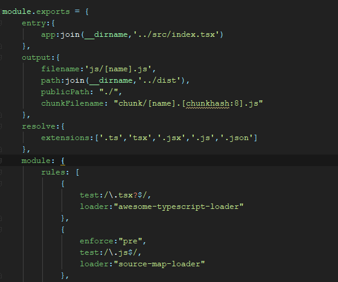
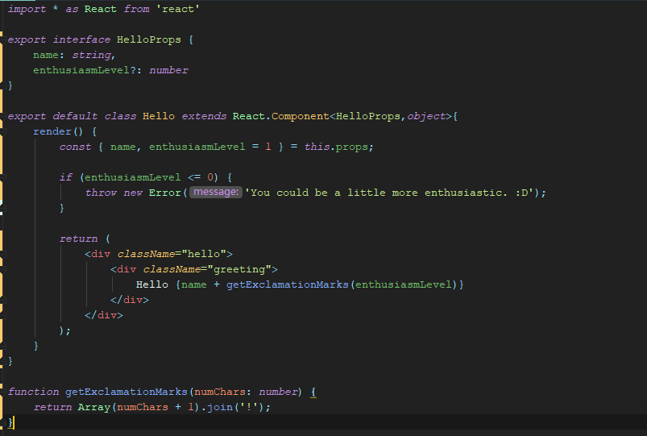
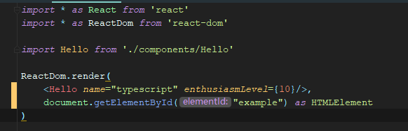
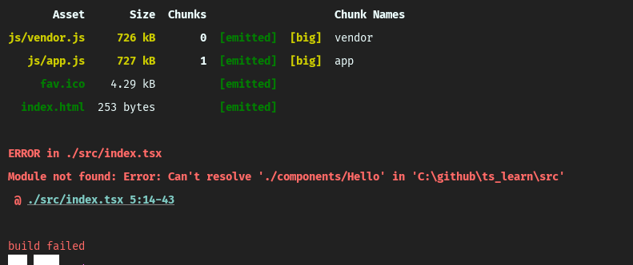
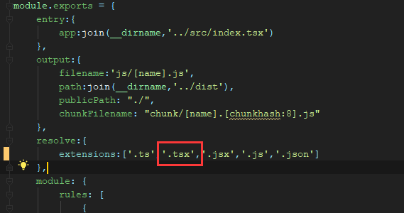
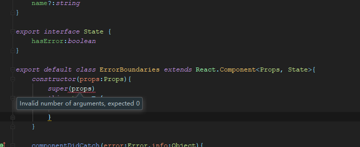

# issues

用typescript写react项目中遇到的一些问题总结。

## 引用路径问题问题

webpack配置

子组件的导出

父组件的引用

打包结果

原因：~~暂未发现~~ webpack配置的时候在`reoslve`中的`tsx`中少加了一个点`.`

解决方案：~~暂无~~ `tsx`修正为`.tsx`

## props报错

参数不对，正常打包，且不报错，就是编辑器这里提示错误

原因： 未知

解决方案：**什么都没改，报错又自动消失了，我去。。。**，怀疑是否是编辑器的设置问题

